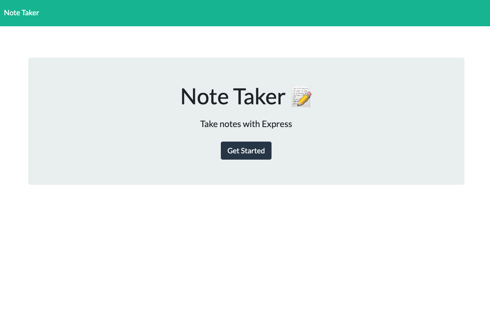

# Note Taker


## Description
This app will allow you to create, display and delete notes in a simple and efficient way powered by Express.js. 

## Table of Contents
- [Installation](#Installation)
- [Preview](#Preview) 
- [Contributing](#Contributing)
- [License](#License)
- [Test](#Test)
- [Questions](#Questions)
- [Deployed](#Deployed)

##  Installation
Clone the repository to your local environment in your terminal using the below command:
```bash
git clone https://github.com/Lismey23/note-taker.git
```
Run ``npm install `` in your CLI to install all dependencies. To use the application locally, run ``node server.js`` in your terminal and then open http://localhost:3001 in your preferred browser. 
The app is also available in<a href= "https://salty-wildwood-80675.herokuapp.com/"> Heroku </a> in a live environment.


##  Preview


##  Contributing
Contributions are welcomed

##  License
MIT

## Test
Feel free to test the application and share feedback.

## Questions
Please feel free to reach me with additional questions: lismeyplasencia@gmail.com
GitHub profile: Lismey23

## Deployed 
<a href= "https://salty-wildwood-80675.herokuapp.com/"> Note Taker App </a>